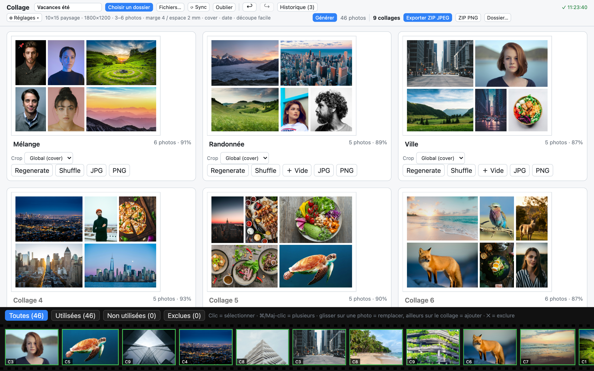
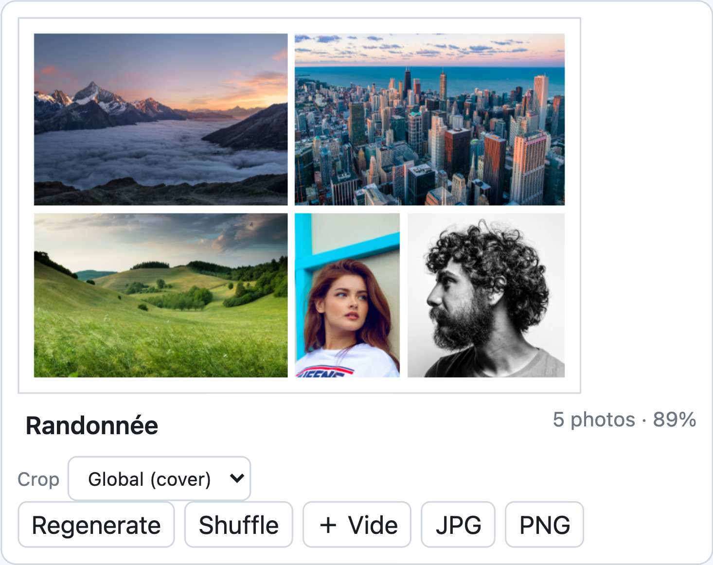
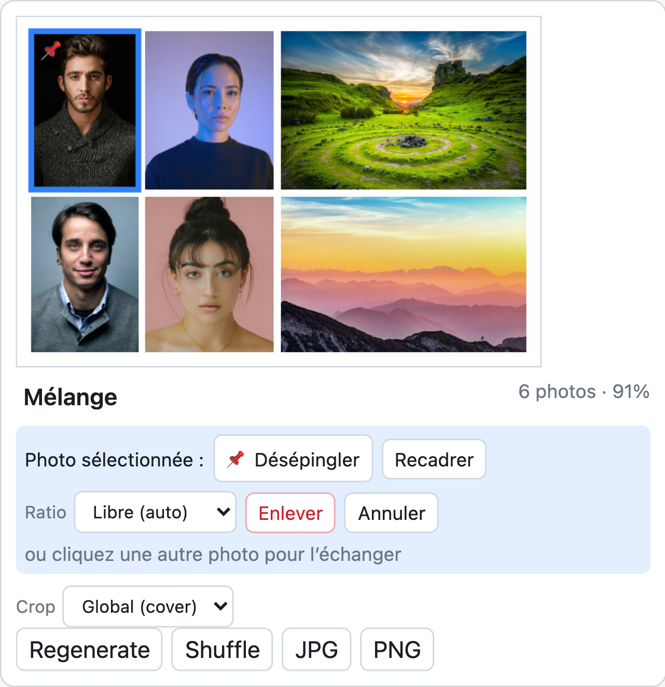
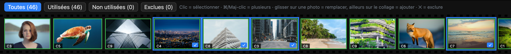
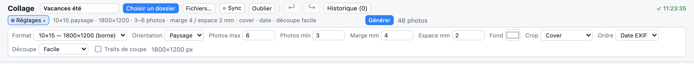

# Collage

Application web **100 % locale** qui compose automatiquement des centaines de photos en collages prêts à imprimer (format 10×15 cm par défaut, compatible bornes photo). Aucune photo n'est envoyée sur un serveur : tout se passe dans le navigateur.

> Dossier de 200 photos → quelques réglages → **Générer** → je vérifie vite → **Exporter** → je mets les JPEG sur la borne.

## Aperçu



<table>
<tr>
<td width="50%"><b>Un collage</b> — partition récursive, tailles différentes, crop minimal<br></td>
<td width="50%"><b>Photo sélectionnée</b> — épingle 📌, recadrage, ratio, enlever, échanger<br></td>
</tr>
</table>

**Pellicule** — statut de chaque photo, filtres, sélection multiple (⌘/Maj-clic) à glisser sur un collage :



**Barre d'outils** — réglages repliables, historique, sauvegarde automatique :



> Captures réalisées avec 46 photos de test [Unsplash](https://unsplash.com/license) (voir [`test-photos/CREDITS.md`](test-photos/CREDITS.md)). Pour les retélécharger : `scripts/fetch-test-photos.sh`.

## Démarrage

```bash
npm install
npm run dev      # http://localhost:5173
npm test         # tests du moteur de layout (Vitest)
npm run build    # vérification TypeScript + build de production
```

Navigateur recommandé : **Chrome / Edge** (File System Access API : dossier mémorisé, reprise en un clic, export dans un dossier). Firefox et Safari fonctionnent via les sélecteurs de fichiers classiques (il faut alors rechoisir le dossier à chaque session).

## Utilisation

1. **Choisir un dossier** (ou glisser-déposer un dossier / des fichiers). L'orientation EXIF est appliquée, la date de prise de vue sert à l'ordre chronologique.
2. Régler le format, les marges, le nombre de photos par collage… puis **Générer**.
3. Vérifier la grille de collages et retoucher si besoin (voir ci-dessous).
4. **Exporter ZIP JPEG** (ou PNG, un collage seul, ou directement dans un dossier).

### Réglages

| Réglage | Détail |
|---|---|
| Format | 10×15 « borne » (1800×1200 px), 10×15 au DPI exact (1772×1181 à 300 DPI), ou personnalisé en cm + DPI |
| Orientation | Paysage / portrait |
| Photos max / min | Le maximum est un **plafond**, pas une obligation. Le minimum est un souhait (les pages plus petites sont pénalisées) |
| Marge / espace | En mm |
| Fond | Couleur de fond |
| Crop | `Cover` (remplit), `Crop minimal` (rogne au plus 12 % puis réduit la photo), `Contain` (photo entière) |
| Ordre | Date EXIF, nom, aléatoire |
| Découpe | `Libre`, `Facile`, `Alignée max` : favorise des coupes droites alignées pour les ciseaux. Option **Traits de coupe** pour dessiner un filet au centre des gouttières |

### Retoucher un collage

- **Regenerate / Shuffle** : cherche une autre disposition pour ce collage seulement.
- **Cliquer une photo** : *Épingler* (📌 position, taille et crop conservés à chaque recalcul, le reste s'adapte autour), *Recadrer* (déplacer / zoomer), *Ratio* (forcer le ratio de la cellule : si le collage ne peut plus l'accueillir, les photos en trop repartent dans la pellicule), *Enlever*, ou cliquer une autre photo pour **échanger**.
- **Enlever** garde la mise en page et laisse un emplacement vide : *Réadapter*, *Garder* ou *Annuler* depuis le bandeau du collage. Une photo enlevée est **exclue** des prochaines générations.
- **＋ Vide** réserve un emplacement à remplir ensuite ; **＋ Nouveau collage** (carte pointillée en fin de grille) crée un collage manuel.
- Le **mode de crop** peut être réglé collage par collage ; les titres de collage sont renommables (ils deviennent les noms de fichiers exportés).

### Pellicule (en bas)

Toutes les photos avec leur statut : **utilisée** (vert, badge `C3` = collage 3), **libre** (orange), **exclue** (grisé). Filtres, bouton ✕ / ↺ pour exclure ou réintégrer.

- **Glisser une vignette** sur une cellule = remplacer ; ailleurs sur le collage = ajouter.
- **⌘/Ctrl-clic** ou **Maj-clic** = sélection multiple, puis glisser le lot sur un collage (ou sur *Nouveau collage*), ou **＋ Ajouter (N)**.
- **⟳ Sync** relit le dossier : les nouvelles photos arrivent dans la pellicule, **inactives** (à activer à la main). Les collages ne bougent pas.

### Raccourcis

| Touche | Action |
|---|---|
| `Échap` | Désélectionner |
| `Suppr` | Enlever la photo sélectionnée |
| `⌘Z` / `⇧⌘Z` (`Ctrl`) | Annuler / rétablir |

### Session, historique, sauvegarde

Tout est **sauvegardé automatiquement** dans le navigateur (IndexedDB) : collages, épingles, noms, exclusions, réglages, nom du projet et **historique** (60 dernières actions, annuler / rétablir et liste cliquable). Un indicateur `✓ hh:mm:ss` confirme l'enregistrement. Au retour : **Reprendre** (Chrome / Edge, avec permission d'accès au dossier) ou rechoisir le même dossier, la session se restaure par correspondance des fichiers (nom + taille + date). Les miniatures sont mises en cache. Les réglages et le nom du projet sont sauvegardés mais ne sont pas dans l'historique.

## Compatibilité borne photo

JPEG baseline, RGB 4:2:0, profil sRGB, sans EXIF, qualité 0,95, 1800×1200 px exactement, densité JFIF renseignée (305 DPI pour 150×100 mm). Noms simples (`collage-001.jpg`) : évitez accents et espaces dans les titres si votre borne est stricte. Gardez au moins 3 mm de marge (certaines bornes recadrent légèrement) et laissez « Traits de coupe » décoché pour imprimer. Le PNG est fourni mais le JPEG est recommandé.

## Comment ça marche

### Layout d'une page (`solveLayout`)

Partition **récursive guillotine** : chaque nœud coupe un rectangle en deux (côte à côte ou empilé), chaque feuille est une photo. Le solver :

1. énumère les arbres de partition possibles (sans doublons équivalents) ;
2. teste plusieurs **permutations** des photos (toutes si peu nombreuses, sinon un échantillon) ;
3. répartit chaque rectangle **proportionnellement aux ratios des photos** pour minimiser le crop ;
4. note chaque candidat et garde le meilleur.

Score (0..1) : crop (40 %), espaces vides (20 %), photos trop petites (15 %), écarts de taille (15 %), équilibre visuel (10 %), pondéré par la découpe facile (lignes de coupe en trop) et par les ratios imposés. Un `budget` d'évaluations borne le temps de calcul même à 8 photos et plus.

### Optimisation globale (`solveBatch`)

Programmation dynamique sur les découpages contigus de la liste ordonnée : coût d'une page = `k·(1 − score) + coût fixe de page + pénalité sous le minimum`. Une photo qui dégrade une page passe sur la suivante, et la fin se rééquilibre (5/5/4 plutôt que 6/6/2). Le calcul tourne dans un **Web Worker**.

### Épingles

L'espace libre autour des photos épinglées est découpé en rectangles (deux stratégies par épingle), les autres photos y sont réparties, et le meilleur score global l'emporte.

### Export

Un **pool de Web Workers** (`OffscreenCanvas`) décode, dessine et encode plusieurs collages en parallèle, une photo originale à la fois pour borner la mémoire.

## Utiliser le solver sans l'interface

Le moteur (`src/engine`) ne dépend pas de React :

```ts
import { solveLayout } from './src/engine/solver'

const result = solveLayout({
  width: 1800, height: 1200,
  photos,            // { id, width, height, focus?, ratio? }[]
  maxPhotos: 6,
  margin: 48, gap: 24,
  cropMode: 'cover', // 'cover' | 'contain' | 'minimal'
})
// → { score: 0.91, photos: [{ id, x, y, width, height, crop, cell, cropLoss }] }
```

`focus` (0..1) est le point d'intérêt utilisé par le crop : c'est le point d'entrée prévu pour du smart crop / détection de visages.

## Architecture

```
src/
├── engine/        moteur de layout, indépendant de React
│   ├── solver.ts      partitions, crop, permutations, épingles
│   ├── scoring.ts     score + lignes de coupe
│   ├── batch.ts       ordre des photos + optimisation globale
│   ├── batch.worker.ts
│   └── solver.test.ts
├── io/            loader (EXIF, miniatures), choix de dossier, session IndexedDB
├── render/        rendu canvas (aperçu + pleine résolution) et worker d'export
├── export/        encodage JPEG/PNG (+ densité), ZIP, écriture dans un dossier
└── ui/            React : App, éditeur de recadrage, styles
```

Stack : TypeScript, React, Vite, Vitest, `exifr` (EXIF), `fflate` (ZIP).

## Limites connues

- Les photos non épinglées ne s'adaptent que dans les rectangles libres autour des épingles.
- L'optimisation globale ne réordonne pas les photos à distance (l'ordre date / nom est respecté).
- HEIC non décodé par Chrome : à convertir au préalable.
- Beaucoup de photos dans une petite zone libre donnent de petites cellules (le score les pénalise, sans éviction automatique pour les épingles).
